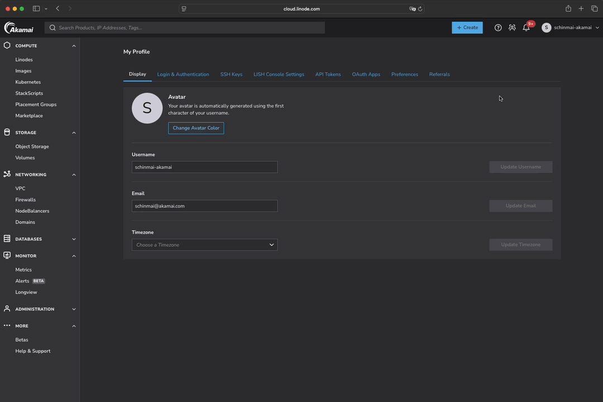
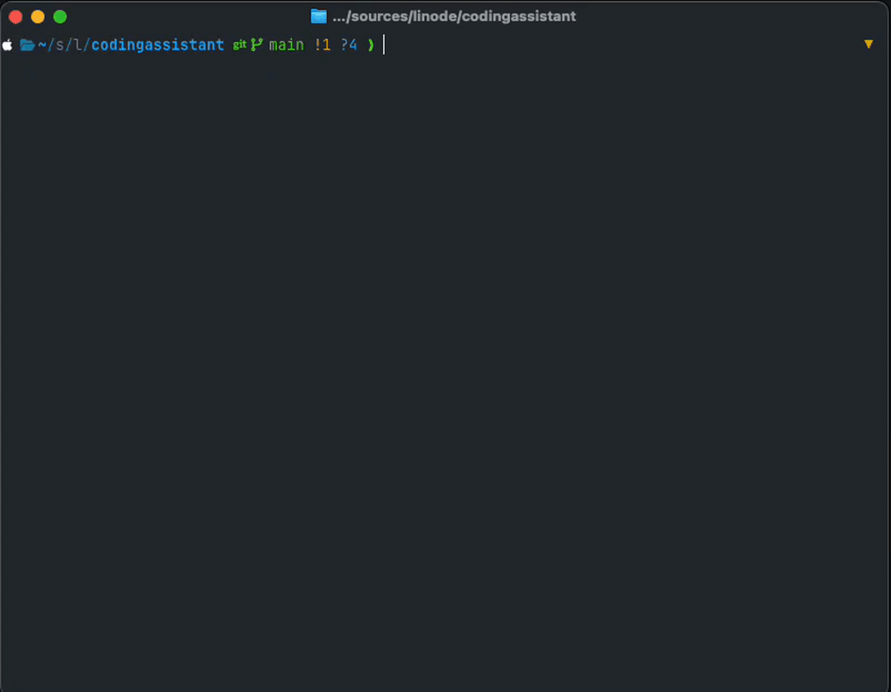
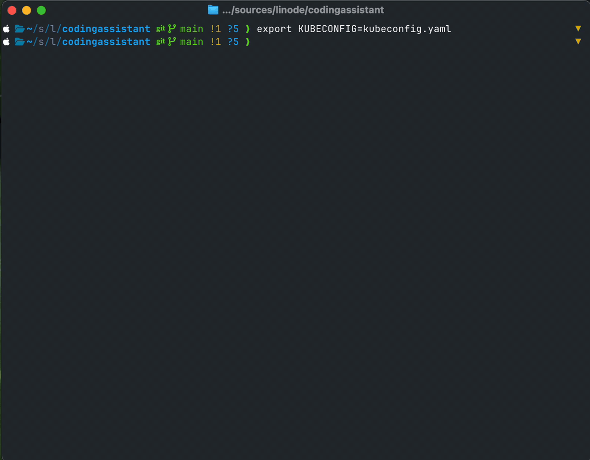
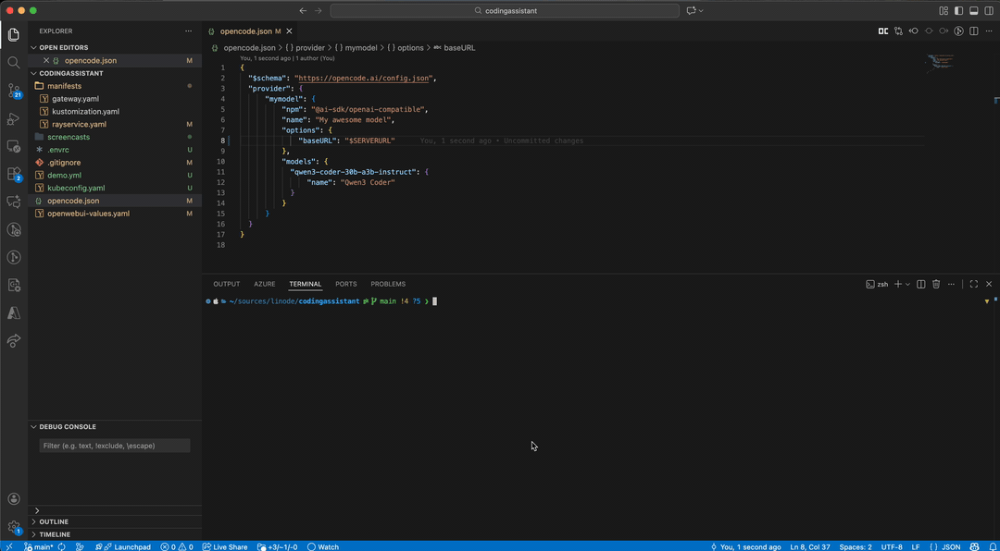
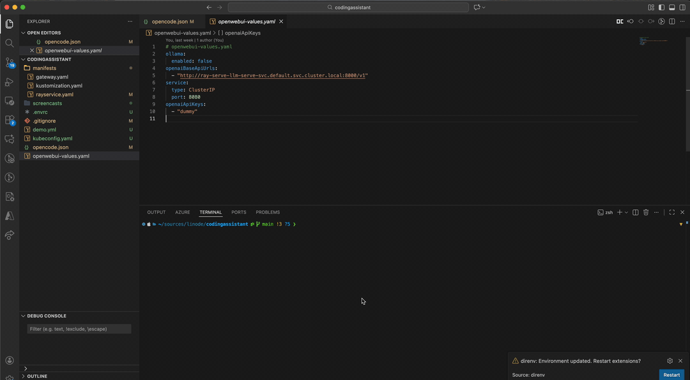

# Deploy your own Coding Assistant on LKE using KubeRay

# Overview

AI coding agents are all the rage, but they come with two significant drawbacks. Unpredictable costs, and an uncertainty about Intellectual Property protection and data privacy. Akamai Inference Cloud lets you tackle both of these problems in one shot. The powerful blackwell GPUs of Akamai Cloud let you run Large Language Models on Akamai Infrastructure. This gives you predictable costs \- you only pay for the hardware you use\! Since you control the entire deployment, you have the flexibility to modify/deploy whatever LLM you want, and can rest assured that your IP is not used for training purposes. 

# Technology Stack

* AI/ML: KubeRay to schedule and deploy LLMs  
* Deployment: Linode Kubernetes Engine with Blackwell GPU NodePools  
* Infrastructure: Linode-Cli for Linode resource provisioning

# Prerequisites

1. A Hugging face account - This is used to download LLM weights  
2. A Linode account with access to blackwell GPUs - raise [support ticket](https://cloud.linode.com/support/tickets?dialogOpen=true) if you can’t see them
    (**Note** This can be used with [RTX 4000 Ada GPUs](https://techdocs.akamai.com/cloud-computing/docs/gpu-compute-instances) as well)
3. Opencode installed on your device  
4. Helm and kubectl installed on your device  
5. Linode CLI installed on your device

ALL code samples are available at [https://github.com/akamai-developers/codingassistant-sample/tree/main](https://github.com/akamai-developers/codingassistant-sample/tree/main) 

# Deployment Steps

## 1. Clone this repository

```sh
git clone <repository-url> codingassistant
cd codingassistant
```

## 2. Create a Linode API key

In the Akamai Cloud Console, create a Linode API key with read/write permissions for Kubernetes, and NodeBalancers, and read permissions for events.  


## 3. Create a LKE Cluster with a blackwell GPU 

Create a LKE Cluster with two node pools \- one with a blackwell-gpu, and one with a standard linode type, to run our other workloads on

```sh
export LINODE_CLI_TOKEN=<token from previous step>

linode-cli lke cluster-create \
--k8s_version 1.34 \
  --label myllm \
  --region us-sea \
  --tier standard \
  --control_plane.high_availability true \
  --node_pools.count 1 \
  --node_pools.type g3-gpu-rtxpro6000-blackwell-2 \
  --node_pools.count 3 \
  --node_pools.type g6-standard-4 \
  --json | jq -r '.[].id'
export CLUSTER_ID=<id from the previous command>
```



## 4. Fetch Kubeconfig, install Nvidia Operator 

Wait for the cluster’s kubeconfig to be ready, and save it.

```sh
linode-cli lke kubeconfig-view $CLUSTER_ID --json  | jq  -r '.[].kubeconfig' | base64 -d > kubeconfig.yaml 
```

Then Install nvidia gpu operator. This provisions and configures the GPU drivers, and the Nvidia device plugin. This step allows us to use the GPU within Kubernetes.

```sh
helm repo add nvidia https://helm.ngc.nvidia.com/nvidia \
helm repo update
helm install --wait --generate-name \
    -n gpu-operator --create-namespace \
    nvidia/gpu-operator \
    --version=v25.10.0
```


## 5. Install KubeRay using helm

```sh
helm repo add kuberay https://ray-project.github.io/kuberay-helm/
helm repo update
# Install both CRDs and KubeRay operator v1.5.0.
helm install --wait kuberay-operator kuberay/kuberay-operator --version 1.5.0
```

Verify that the operator is running ok

```sh
kubectl get po
NAME                                READY   STATUS    RESTARTS   AGE
kuberay-operator-5c575cccb6-b99wj   1/1     Running   0          12m
```


## 6. Install gateway API CRDs & Istio

Gateway API is the modern way of doing ingress to services in a Kubernetes cluster. The CRDs give us the primitives we need  
 

```sh
kubectl get crd gateways.gateway.networking.k8s.io &> /dev/null || \
{ kubectl kustomize "github.com/kubernetes-sigs/gateway-api/config/crd?ref=v1.4.0" | kubectl apply -f -; }
```

Install Istio using helm. Istio is going to be the “Gateway Controller” which takes the `Gateway` custom resources and creates a linode `NodeBalancer` to route traffic from outside the cluster to the LLM running inside the cluster

```
helm repo add istio https://istio-release.storage.googleapis.com/charts
helm repo update

helm install --wait istio-base istio/base -n istio-system --set defaultRevision=default --create-namespace
helm install --wait istiod istio/istiod -n istio-system
```


## 7. Create a HuggingFace APIToken

HuggingFace allows you to download models from multiple providers \- it is similar to dockerHub, but for MachineLearning Models. Create an API key to download models


Once you have the hugging face token, set it in your environment. Also generate a random key \- this key will be used to secure traffic to the LLM we deploy. Choose this at random, and export it into the environment. 

```sh
echo "export HF_TOKEN=<yourtokenhere>" > .envrc
echo "export OPEN_API_KEY=<your chosen key here>" > .envrc
```

## 8. Deploy 🚀

Now we’re all set to deploy things to the cluster\! Deploy the ray-serve config \- this deploys the model qwen-coder-30b.  Qwen is a family of models developed by Alibaba. The 30b coder model is optimized for coding tasks, but isn’t super huge that you need a GPU farm to run. It strikes a balance between capabilities and being lightweight. 

This step will take some time, so this will be a great time to grab a cup of your favorite beverage 😀

```sh
source .envrc
export KUBECONFIG=kubeconfig.yaml
kustomize build manifests | envsubst | kubectl apply -f -
```

Wait for it to be healthy - check status for the model

```sh
kubectl describe rayservice ray-serve-llm
```



## 9. Inspect model using the dashboard

KubeRay allows us to view the status and inspect the state of the cluster \- the admin interface can be accessed using a port-forward

```sh
kubectl port-forward svc/ray-serve-llm-head-svc 8265
```


## 10. Testing time 🧪

Test your model by sending some test messages

```sh
SERVICE_IP=$(kubectl get svc llm-gateway-istio -o yaml | yq -r '.status.loadBalancer.ingress[0].ip')

curl --location "http://$SERVICE_IP/v1/chat/completions" --header "Authorization: Bearer $OPEN_API_KEY" --header "Content-Type: application/json" --data '{
      "model": "qwen3-coder-30b-a3b-instruct",
      "messages": [
          {
              "role": "system", 
              "content": "You are a helpful assistant."
          },
          {
              "role": "user", 
              "content": "Provide steps to configure Ray on LKE"
          }
      ]
  }'
```


## 11. Configure OpenCode

```sh
SERVICE_IP=$(kubectl get svc llm-gateway-istio -o yaml | yq -r '.status.loadBalancer.ingress[0].ip')
```
```sh
{
    "$schema": "https://opencode.ai/config.json",
    "provider": {
        "mymodel": {
            "npm": "@ai-sdk/openai-compatible",
            "name": "My awesome model",
            "options": {
                "baseURL": "http://$SERVICE_IP/v1"
            },
            "models": {
                "qwen3-coder-30b-a3b-instruct": {
                    "name": "Qwen3 Coder"
                }
            }
        }
    }
}
```

And then login using 

```sh
opencode auth login
```

And scroll all the way to the bottom and choose other, enter your API key



## 12. Configure OpenWebUI (Optional)

Sometimes, it's nice to open-up the browser and just chat with the LLM, instead of firing up opencode. Let's see how to do that\!

```sh
cat <<EOF >openwebui-values.yaml
ollama:
  enabled: false
openaiBaseApiUrls:
  - "http://ray-serve-llm-serve-svc.default.svc.cluster.local:8000/v1"
openaiApiKeys:
  - "$OPEN_API_KEY"

service:
  type: ClusterIP #change this to Loadbalancer to expose this publicly.
  port: 8080
EOF
```
```sh
helm install open-webui open-webui/open-webui \
  --namespace open-webui \
  --create-namespace \
  -f openwebui-values.yaml
```



Chat away!


